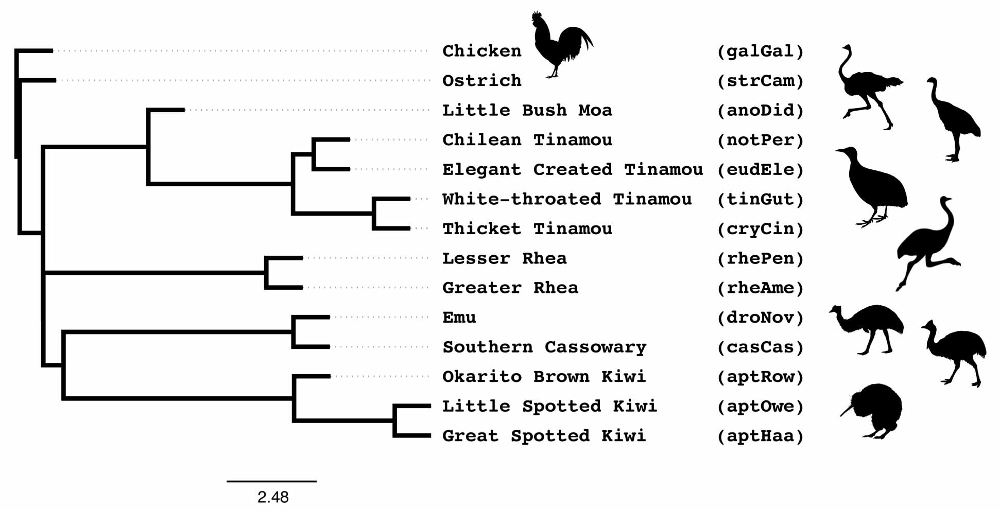

Coalescent Lab
===

The goal of this lab is to learn (or reinforce) some of the core principles behind coalescent species tree methods, through hands-on experience. 

During this lab, we will

* compute the probability of a (gene tree) topology given an MSC model species tree
* run quartet-based coalescent methods, including gene tree summary methods and site-based methods
* use quartet concordance factors (qCFs) to evaluate the pseudo-likelihood of a species tree (+ visualize goodness of fit)

and interpret the results of these analyses. We will utilize real and synthetic data for *Palaeognathae* (flightless birds), considering the effects of incomplete lineage sorting (ILS), gene tree estimation error (GTEE), and data type.

This study system was selected because concatenation (RaxML and ExaML) and coalescent methods (ASTRAL and MP-EST) have yielded different results with respect to the placement of Rheas [[Cloutier *et al.* (2019)]](https://doi.org/10.1093/sysbio/syz019).
Additionally, the data for *Palaeognathae* are publicly available well-curated, cover several different marker types (ranging from UCEs to CR1 retrotransposon insertions), and are small enough to analyze with a variety of methods (there are 15 taxa so just 1365 subsets of 4 taxa need to be evaluated by methods that explicitly enumerate all quartets).

* Go to [Day 1 Lab](day1/README.md).
* Go to [Day 2 Lab](day2/README.md).

Acknowledgements
---
This lab was created for the [2024 Workshop on Phylogenomics @ Cesky Krumlov](https://evomics.org/2024-workshop-on-phylogenomics-cesky-krumlov/); thank you to the organizers for inviting me.

Data used in this lab were generated by [Cloutier *et al.* (2019)](https://doi.org/10.1093/sysbio/syz019); also see [Sackton *et al.* (2019)](https://doi.org/10.1126/science.aat7244).
Thanks to Cloutier *et al.* (2019) for depositing many (if not all) of their intermediate data files in [Dryad](https://doi.org/10.5061/dryad.fj02s0j), making the re-analysis highly accessible.
The available files included estimated alignments and gene trees for 3158 ultraconserved elements (UCEs), 5016 introns, and 12676 conserved non-exonic elements (CNEEs) as well as data for 4301 retrotransposon (CR1) insertions.
These data have since been re-analyzed by [Simmons *et al.* (2022)](https://doi.org/10.1016/j.ympev.2021.107344) and [Takezaki (2023)](https://doi.org/10.1093/gbe/evad092).
Both looked at the effects of taxon sampling, specifically the inclusion or exclusion of the outgroup chicken.
Simmons *et al.* (2022) also identified 105 UCEs with homology errors and recovered an additional 44 CR1 retrotransposons (note that the data sets in this repository have been updated accordingly).
Lastly, Cloutier *et al.* (2019) performed coalescent simulations based on their estimated species and made the model trees, synthetic gene trees, and simulation scripts available.

Bird images were downloaded from [PhyloPic](https://www.phylopic.org).
