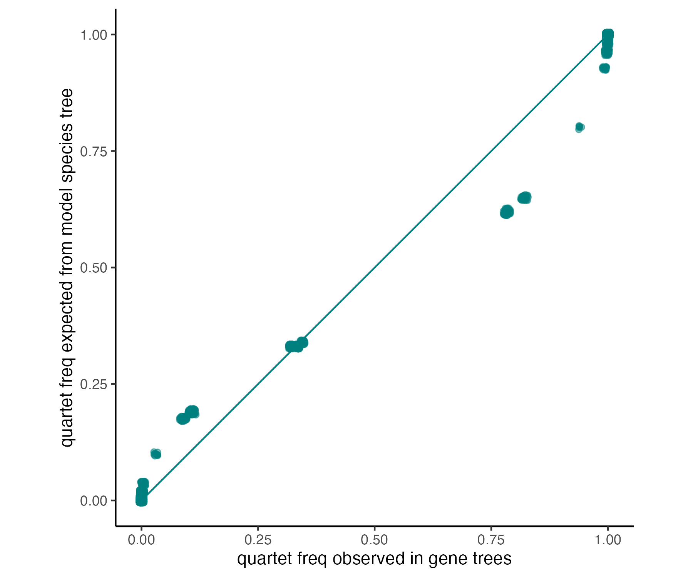
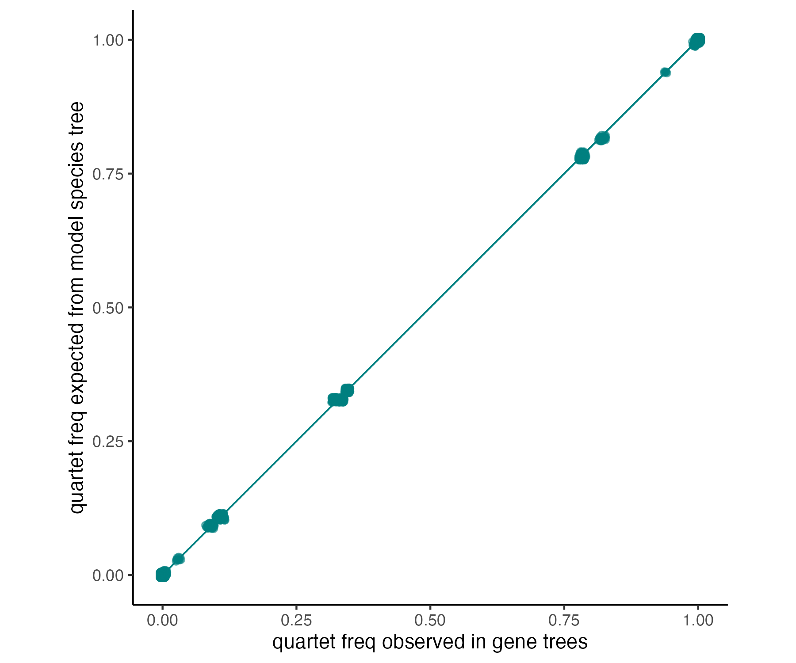
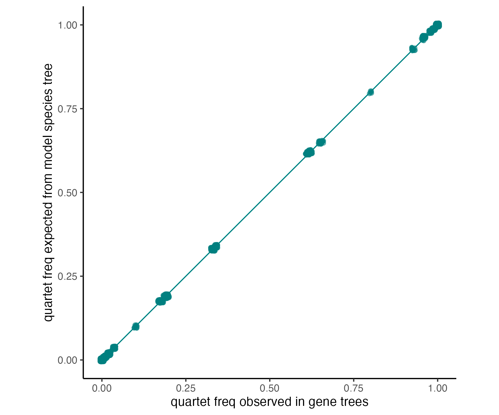

This directory simulated data based on [Cloutier *et al.* (2019)](https://doi.org/10.1093/sysbio/syz019). 

| Data | File |
| --- | --- |
| MSC model species tree from Cloutier *et al.* (2019) with branch lengths in CUs (note that model is based on the ASTRAL UCE tree)| [`model-species-tree.tre`](model-species-tree.tre) | 
| Gene trees simulated within MSC model species tree with [Phybase](https://github.com/lliu1871/phybase) | [`simulated-gene-trees.tre`](simulated-gene-trees.tre) |

---

These files come from the following steps.

1. Downloaded `species_trees.tar.gz` and `coalescent_simulations.tar.gz`  from [Dryad](https://doi.org/10.5061/dryad.fj02s0j) in January 2024.

2. Combined the 10,000 gene trees simulated within the ASTRAL UCE tree from `coalescent_simulations/ASTRAL_branchlength_simulated_gene_trees/UCEs_simulated_gene_trees` into a single file [`cloutier2019_UCE_astral_sim_gene_trees.tre`](cloutier2019/cloutier2019_UCE_astral_sim_gene_trees.tre). 

3. Copied the ASTRAL UCE tree used in PhyBase simulations from `coalescent_simulations/ASTRAL_branchlength_simulated_gene_trees` and changed its name to [`cloutier2019_UCE_astral_4sim.tre`](cloutier2019/cloutier2019_UCE_astral_4sim.tre).

4. Created [CU tree](cloutier2019/cloutier2019_UCE_astral_4sim_CUs.tre) from Phybase model species tree by removing terminal branch information and (2) converting the internal branch information to coalescent units (CUs), specifically `X#Y` was converted to `X / Y`.

*Note: Branch lengths in the CU tree seem similar to [ASTRAL UCE tree](../species-trees/UCE_astral.tre), as expected.*

5. Checked simulation results seemed reasonable with [PhyloNetworks](https://crsl4.github.io/PhyloNetworks.jl/latest/) by comparing the quartet frequencies in the simulated gene trees to their expected frequencies in the CU (model species) tree.

```
using PhyloNetworks;
using CSV;
using RCall;
@rlibrary ggplot2

# Specify files
gt_file = "cloutier2019/cloutier2019_UCE_astral_sim_gene_trees.tre"
st_file = "cloutier2019/cloutier2019_UCE_astral_4sim_CUs.tre"
qf_file = "cloutier2019/cloutier2019_exp_vs_obs_qfreqs.png"

# Get quartet frequencies in gene trees
genetrees = readMultiTopology(gt_file);
q,t = countquartetsintrees(genetrees);
df = writeTableCF(q,t);
CSV.write("tableCF.csv", df);
gtCF = readTableCF("tableCF.csv");

# Read species trees
speciestree = readTopology(st_file)

# Compute pseudo-likelihood to get expected quartet frequencies
loglik = topologyQPseudolik!(speciestree, gtCF);
loglik

# Plot data
df_long = fittedQuartetCF(gtCF, :long);
ggplot(df_long, aes(x=:obsCF,y=:expCF)) +
	theme_classic() + 
	geom_segment(x=0,y=0,xend=1,yend=1, color="#008080", linewidth=0.3) + 
	geom_point(alpha=0.5, color="#008080", position=position_jitter(width=0.005, height=0.005)) + 
	ylab("quartet freq expected from model species tree") + 
	xlab("quartet freq observed in gene trees") + 
	coord_equal(ratio=1);
ggsave(qf_file, scale=1, width=6, height=5);
exit();
```

**Expected vs observed quartet frequencies are NOT well correlated for original model species tree and original 10,000 simulated gene trees.**

<p align="center">

</p>

6. Created [CU 2X tree](cloutier2019/cloutier2019_UCE_astral_4sim_CUs_2x.tre) by doubling the branch lengths in [CU tree](cloutier2019/cloutier2019_UCE_astral_4sim_CUs.tre).

*Note: branch lengths in this CU 2X tree seem too long compared to [ASTRAL UCE tree](../species-trees/UCE_astral.tre).*

7. Checked the simulation again, setting
```
gt_file = "cloutier2019/cloutier2019_UCE_astral_sim_gene_trees.tre"
st_file = "cloutier2019/cloutier2019_UCE_astral_4sim_CUs_2X.tre"
qf_file = "cloutier2019/cloutier2019_2X_exp_vs_obs_qfreqs.png"
```
in the commands above.

**Expected vs observed quartet frequencies are now well correlated for the CU 2X (model species) tree and the original 10,000 simulated gene trees.**

<p align="center">

</p>

8. Created [updated PhyBase model tree](redo/redo_UCE_astral_4sim.tre) by halving branch lengths in [original PhyBase model tree](cloutier2019/cloutier2019_UCE_astral_4sim.tre).

9. Copied R script from `coalescent_simulations/scripts/` and renamed to [`cloutier2019_phybase_sim.R`](cloutier2019/cloutier2019_phybase_sim.R).

10. Created [similar R script](redo/redo_phybase_sim.R) to simulate gene trees from the updated Phybase model tree and then simulated 10,000 [new gene trees](redo_UCE_astral_sim_gene_trees.tre).

11. Checked the new simulation, setting
```
gt_file = "redo/redo_UCE_astral_sim_gene_trees.tre"
st_file = "cloutier2019/cloutier2019_UCE_astral_4sim_CUs.tre"
qf_file = "redo/redo_exp_vs_obs_qfreqs.png"
```
in the commands above.

**Expected vs observed quartet frequencies are well correlated for original model species tree and new 10,000 simulated gene trees.** 

<p align="center">

</p>

*Note that [Allman *et al.* (2023)](https://doi.org/10.1109/TCBB.2022.3177956) reported misunderstanding phybase simulator parameters and recent updates to the documentation by the developers. 
It looks like `X#Y` has units `X = t mu` and `Y = 4 N mu`. Therefore, `X/Y = 0.5CU` i.e. `CU = 2X/Y`.*

12. Copied `cloutier2019_UCE_astral_4sim_CUs.tre` to `model-species-tree.tre` and `redo_UCE_astral_sim_gene_trees.tre` to `simulated-gene-trees.tre`.
