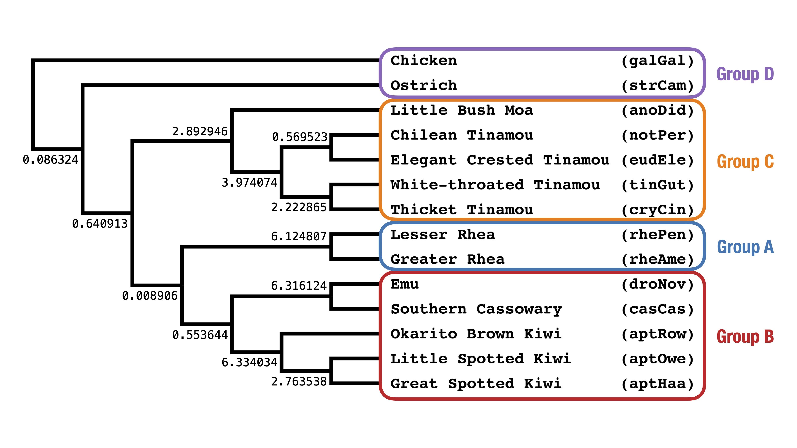

Coalescent Lab - Day 1
===

In this lab, we will analyze gene trees **simulated** based on the ASTRAL UCE species tree from [Cloutier et al. (2019)](https://doi.org/10.1093/sysbio/syz019).

<p align="center">

</p>

The lab today is fairly structured with lots of commands provided - it's also kind-of long... don't worry, the lab tomorrow is shorter and more open-ended.  

Data files
---

| Data | File |
| --- | --- |
| MSC model species tree| [`../data/simulations/model-species-tree.tre`](../data/simulations/model-species-tree.tre) | 
| 10,000 gene trees simulated from model species tree| [`../data/simulations/simulated-gene-trees.tre`](../data/simulations/simulated-gene-trees.tre) |


Before you begin
---
Change into the `day1` directory and copy the files listed below into it e.g. with the following commands.
```
cp ../data/simulations/model-species-tree.tre .
cp ../data/simulations/simulated-gene-trees.tre .
```

Activities
---

**[Activity A](activityA.md):** Check if the model species tree is in the anomaly zone with [PhyloNet](https://phylogenomics.rice.edu/html/phylonet.html)

**[Activity B](activityB.md):** Calculate expected quartet frequencies by hand

**[Activity C](activityC.md):** Run quartet-based summary methods [ASTRAL](https://github.com/chaoszhang/ASTER/) and [TREE-QMC](https://github.com/molloy-lab/TREE-QMC)

**[Activity D](activityD.md) (Optional):** Evaluate pseudolikelihood and check goodness of fit with [PhyloNetworks](https://crsl4.github.io/PhyloNetworks.jl/latest/)
