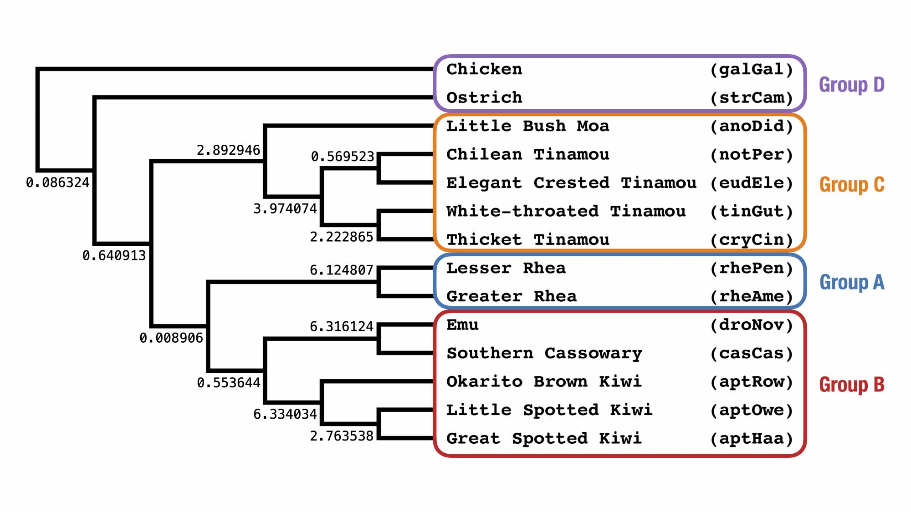

Activity A: Check if the model species tree is in the anomaly zone
===

**Question A1:** Looking at the model species tree below, would guess that it is in the anomaly zone? Why or why not?

<p align="center">

</p>

If it is in the anomaly zone, there must be (at least) one tree topology that is different than the species tree topology and has a higher probability than it under the MSC. Our goal is to come up with topologies that may have a higher probability than the species tree topology and then evaluate their likelihood to check.

Let's consider the focal branch for the placement of Rhea (group **A**), which has length 0.008906 CUs.

The quartets *around* this focal branch have topology **a,b|c,d** where **a** is a taxon from group **A** (Rheas), **b** is from group **B** (Emu+Cassowary+Kiwis), **c** is from group **C** (Tinamous+Moa), and **d** is from the remainder of species called group **D** (Ostrich,Chicken). 

Alternative topologies for the placement of Rhea can be created by performing Nearest Neighbor Interchanges (NNIs) around the focal branch in the species tree (also `gt1` below); this gives `gt2` and `gt3`.
A fourth tree (`gt4`) is created by taking `gt3`, splitting clade `B` into `B1` (Emu+Cassowary) and `B2` (Kiwis), detaching clade `C`, and then re-connecting it to clade `B1`. 
All of these trees are rooted at the outgroup `galGal`.

```
gt1 = ((((A,(B1,B2)),C),strCam),galGal);
gt2 = ((((A,C),(B1,B2)),strCam),galGal);
gt3 = (((((B1,B2),C),A),strCam),galGal);
gt4 = (((((B1,C),B2),A),strCam),galGal);
```

where

```
A = (rhePen,rheAme)
B1 = (droNov,casCas)
B2 = (aptRow,(aptOwe,aptHaa))
C = (((notPer,eudEle),(tinGut,cryCin)),anoDid)
```

To compute the probability of these topologies given the MSC model species tree, do the following.
1. Create a NEXUS file (e.g. `compute_loglk.nex`)

2. Copy the text below into the file
```
#NEXUS

BEGIN TREES;
tree gt1 = (((((rhePen,rheAme),((droNov,casCas),(aptRow,(aptOwe,aptHaa)))),(((notPer,eudEle),(tinGut,cryCin)),anoDid)),strCam),galGal);
tree gt2 = <add newick string here>
tree gt3 = <add newick string here>
tree gt4 = <add newick string here>
END;

BEGIN NETWORKS;
Network st = <add newick string for model species tree here>
END;

BEGIN PHYLONET;
CalGTProb st (gt1);  
CalGTProb st (gt2);
CalGTProb st (gt3);
CalGTProb st (gt4);
END;
```

3. Fill in the newick strings for  `gt2`, `gt3`, and `gt4` by combining the newick strings above.

*Tip: Try replicating the result for `gt1` by copying the newick string for `gt1` into the NEXUS file, replacing the `A` with `(rhePen,rheAme)`, and repeating for clades `B1`, `B2`, and `C`.*

4. Add the newick string for the model species tree

*Tip: Use the command `cat model-species-tree.tre` to see the newick string.*

5. Run [PhyloNet](https://phylogenomics.rice.edu/html/phylonetTutorial.html) with the command `java -jar PhyloNet.jar compute_loglk.nex`

6. Convert the log-likelihood $x$ of each gene tree into a probability via $e^x$.

**Question A2:** Which of `gt1`, `gt2`, `gt3`, or `gt4` has the highest probability? Can we conclude whether the species tree is in the anomaly zone from this analysis?

---

Go to **[Activity B](activityB.md)**.

---

For later e.g. on the flight home :)
---

The challenge in the above example is creating tree topologies that could have higher probability than the specie stree topology. 

To build intuition on how this is done, restrict the above analysis to four taxa: `rhePen` (from clade A), `droNov` (from clade B1), `aptRow` (from clade B2), and `notPer` (from clade C); this produces the following trees: 

```
st = (((rhePen,(aptRow,droNov):0.553644):0.008906),notPer);

gt1 = ((rhePen,(aptRow,droNov)),notPer);
gt2 = ((rhePen,notPer),(aptRow,droNov));
gt3 = (((aptRow,droNov),notPer),rhePen);
gt4 = (((droNov,notPer),aptRow),rhePen);
```

Compute the probabilities of `gt1`, `gt2`, `gt3`, and `gt4` with PhyloNet.
Now compute the probabilities of the four rooted gene trees by hand (look at the slides for helpful equations).

**Question A3:** Based on this calculation, why does the balanced (or symmetric) topology (`gt2`) have higher probability than the pectinate (or assymetric) topologies  (`gt1`, `gt3`, and `gt4`)?

*Tip: Read [Degnan and Rosenberg (2006)](https://doi.org/10.1371/journal.pgen.0020068).*

Credits
---
* [PhyloNet Manual](https://phylogenomics.rice.edu/html/commands/CalGTProb.html)
