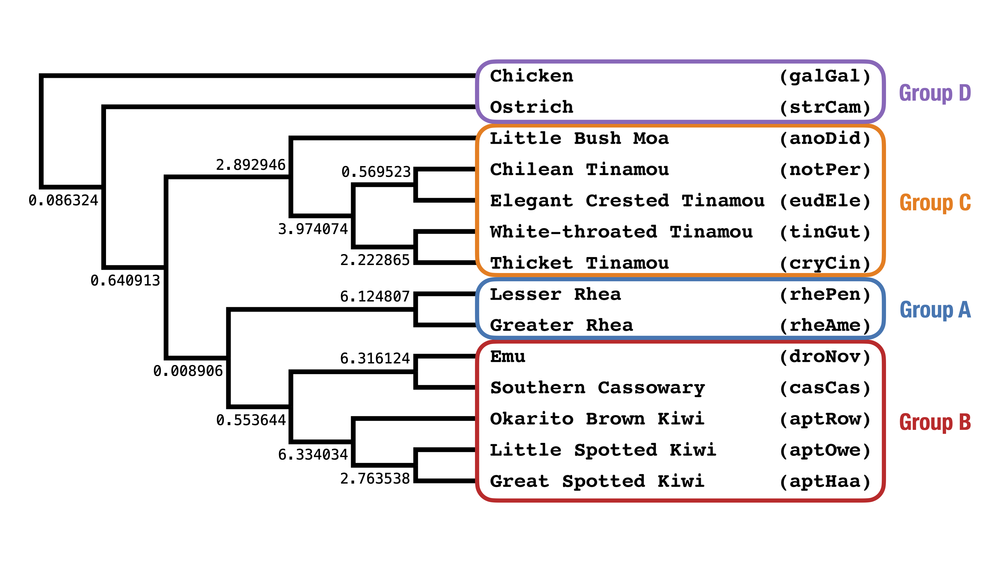

Activity A: Check if the model species tree is in the anomaly zone
===

**Question A1:** Looking at the model species tree below, would guess that it is in the anomaly zone? Why or why not?

<p align="center">

</p>

If it is in the anomaly zone, there must be (at least) one tree topology that does NOT agree with the species tree and has a higher probability under the MSC than the species tree topology. Our goal is to come up with topologies that may have a higher probability than the species tree topology.

Let's consider the focal branch for the placement of Rhea (group **A**), which has length 0.008906 CUs.

The quartets *around* this focal branch have topology **a,b|c,d** where **a** is a taxon from group **A** (Rheas), **b** is from group **B** (Emu+Cassowary+Kiwis), **c** is from group **C** (Tinamous+Moa), and **d** is from the outgroup **D** (Ostrich/Chicken). 

Alternative topologies for the placement of Rhea can be created by performing Nearest Neighbor Interchanges (NNIs) around the focal branch; this gives the 3 topologies below, all rooted at the outgroup `galGal`.

```
gt1 = ((((cladeA,cladeB),cladeC),strCam),galGal);
gt2 = ((((cladeA,cladeC),cladeB),strCam),galGal);
gt3 = ((((cladeB,cladeC),cladeA),strCam),galGal);
```

where

```
cladeA = (rhePen,rheAme)
cladeB = ((droNov,casCas),(aptRow,(aptOwe,aptHaa)))
cladeC = (((notPer,eudEle),(tinGut,cryCin)),anoDid)
```

To compute the probability of these topologies under the MSC model species tree, try the following.
1. Create a NEXUS file (e.g. `phylonet.nex`)
2. Copy the text below into the file
```
#NEXUS

BEGIN TREES;
tree gt1 = <add newick string here>
tree gt2 = <add newick string here>
tree gt3 = <add newick string here>
END;

BEGIN NETWORKS;
Network st = <add newick string for model species tree here>
END;

BEGIN PHYLONET;
CalGTProb st (gt1);  
CalGTProb st (gt2);
CalGTProb st (gt3);
END;
```
3. Fill in the newick strings for  `gt1`, `gt2`, and `gt3` by combining the newick strings above
4. Add the newick string for the model species tree
5. Run [PhyloNet](https://phylogenomics.rice.edu/html/phylonetTutorial.html) with the command `java -jar PhyloNet.jar phylonet.nex`
6. Convert the log-likelihood of each gene tree into a probability via $e^{loglik}$.

**Question A2:** Which of `gt1`, `gt2`, or `gt3` has the highest probability? Can you conclude whether the species tree is in the anomaly zone from this analysis?

Beyond this activity
---

Consider restricting the above analysis to four taxa: `notPer,aptRow,droNov,rhePen` but computing the probabilities by hand.

```
st = (((rhePen,(aptRow,droNov):0.553644):0.008906),notPer);

gt1 = ((rhePen,(aptRow,droNov)),notPer);
gt2 = ((rhePen,notPer),(aptRow,droNov));
gt3 = (((aptRow,droNov),notPer),rhePen);
```

**Question A3:** How does this calculation differ for the balanced (or symmetric) toplogy (`gt2`) vs pectinate (or assymetric) topologies (`gt1` and `gt3`)?

*Tip: Read [Degnan and Rosenberg (2006)](https://doi.org/10.1371/journal.pgen.0020068).*

Credits
---
* [PhyloNet Manual](https://phylogenomics.rice.edu/html/commands/CalGTProb.html)

---

Go to **[Activity B](activityB.md)**.
