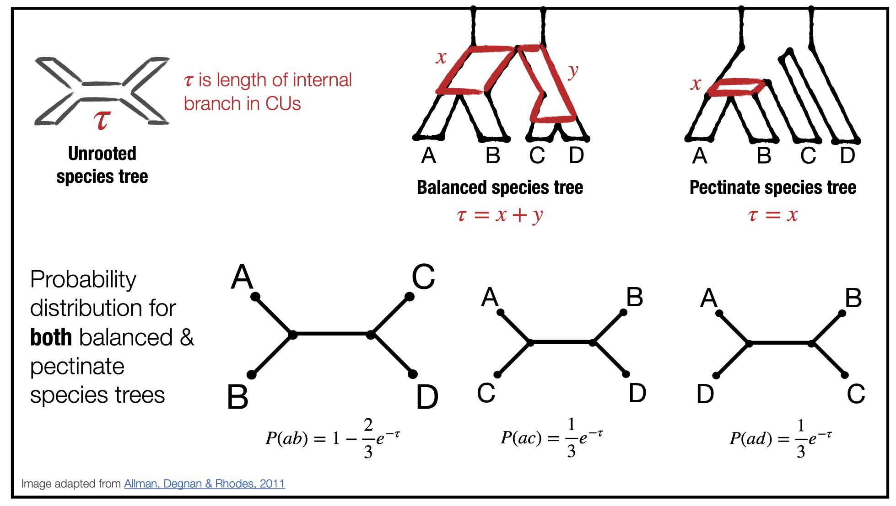

Activity B: Calculate expected quartet frequencies by hand
===

Let's look at the model species tree below and determine the expected frequencies of quartets in the gene trees by hand. 

**Question B1:** What quartet is on species set `galGal,cryCin,rhePen,aptRow` in the model species tree above? What are the two alternative quartet topologies/

**Question B2:** What is the probability of the quartet from question B1 given the MSC model species tree above? What is the probability of the two alternative quartets?

**Question B3:** Repeat questions B1-B2 for species set: `aptRow,cryCin,rhePen,strCam`.

**Question B4:** Repeat questions B1-B2 for species set: `anoDid,cryCin,eudEle,tinGut`.

**Question B5:** Repeat questions B1-B2 for species set: `anoDid,eudEle,notPer,tinGut,`.

**Question B6:** How do the expected quartet frequencies change with branch length in the model species tree?

---

Go to **[Activity C](activityC.md)**.
