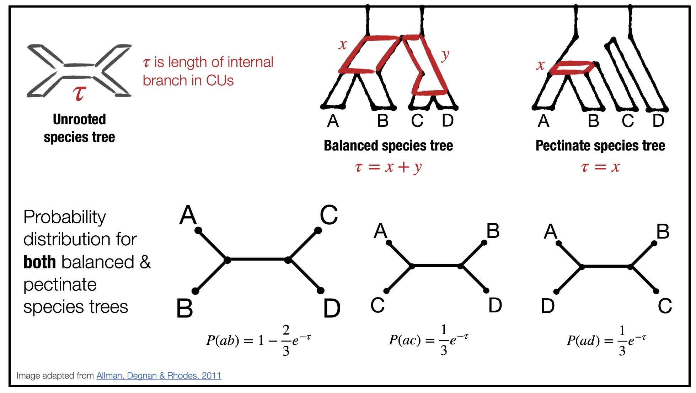

Activity B: Calculate expected quartet frequencies by hand
===

If you estimate a species tree from gene trees, you may be interested in quantifying the **conflict** between the gene trees and the species tree, especially at particular branches. For such analyses, it can be helpful to look at quartets. Let's compute the expected frequencies of quartets in the gene trees for the MSC model species tree below. 

**Question B1:** What quartet is on species set `galGal,cryCin,rhePen,aptRow` in the model species tree above? What are the two alternative quartet topologies?

**Question B2:** What is the probability of the quartet from question B1 given the MSC model species tree above? What is the probability of the two alternative quartets?

**Question B3:** Repeat questions B1-B2 for species set: `aptRow,cryCin,rhePen,strCam`.

**Question B4:** Repeat questions B1-B2 for species set: `anoDid,cryCin,eudEle,tinGut`.

**Question B5:** Repeat questions B1-B2 for species set: `anoDid,eudEle,notPer,tinGut,`.

**Question B6:** How do the expected quartet frequencies change with branch length in the model species tree?

---

Go to **[Activity C](activityC.md)**.
