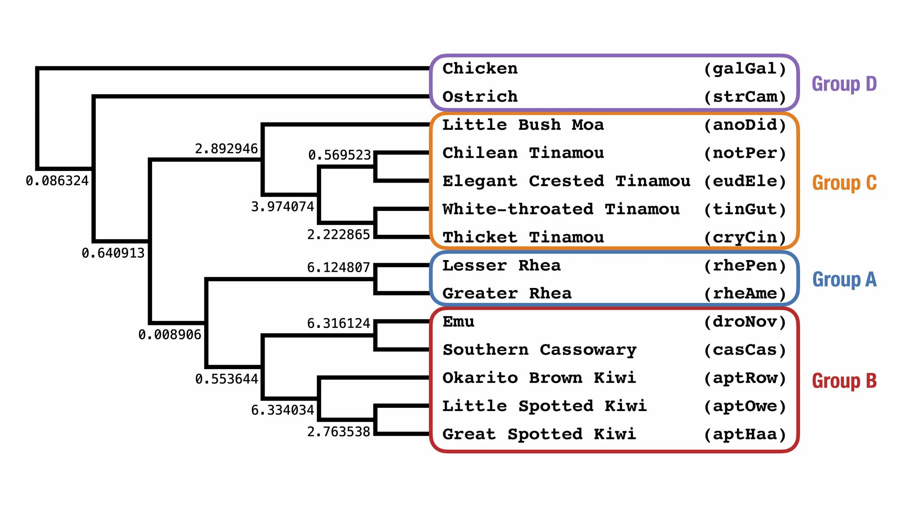

Activity B: Calculate expected quartet frequencies by hand
===

Let's look at the model species tree below and determine the expected frequencies of quartets in the gene trees by hand. 

**Question B1:** What quartet is on species set: `galGal,cryCin,rhePen,aptRow`? What is the expected frequency of this quartet (call `q1`) in the gene trees? What is the expected frequency of the two alternative quartets (call `q2` and `q3`)?

**Question B2:** Repeat questions A1 for species set: `aptRow,cryCin,rhePen,strCam`.

**Question B3:** Repeat questions A1 for species set: `anoDid,cryCin,eudEle,tinGut`.

**Question B4:** Repeat questions A1 for species set: `anoDid,eudEle,notPer,tinGut,`.

**Question B5:** How do the expected quartet frequencies in the gene trees change with branch length in the model species tree?

---

Go to **[Activity C](activityC.md)**.
