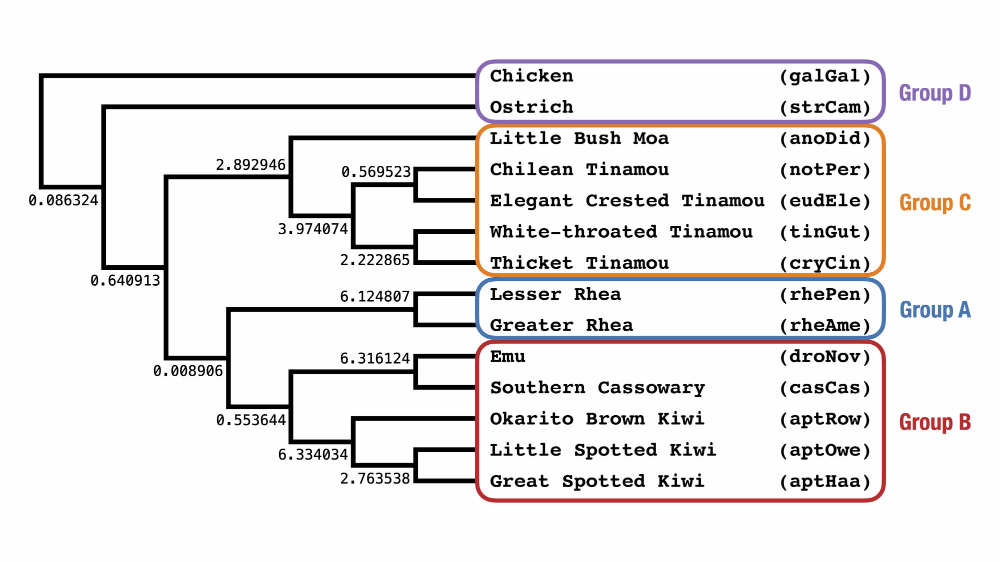
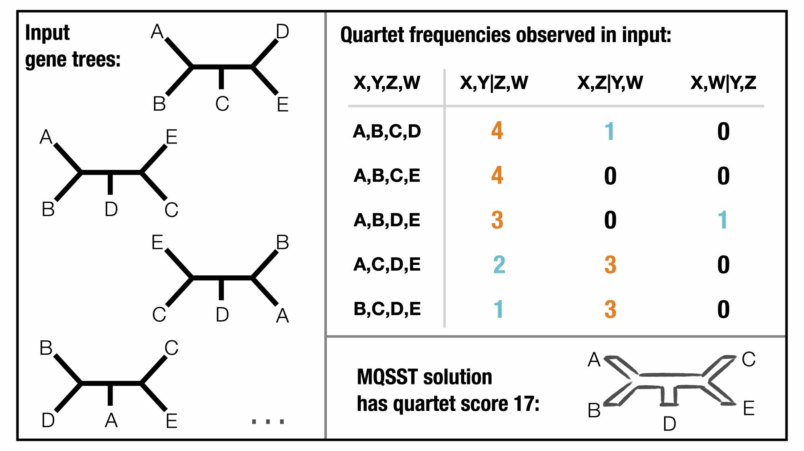

Activity C: Run quartet-based summary methods
===

Now let's reconstruct a species tree from gene trees simulated under the model species tree below.

<p align="center">

</p>

This lab focuses on coalescent methods based on quartets, the earliest of which was perhaps Bucky-pop [[Ane *et al.*, 2006](https://doi.org/10.1093/molbev/msl170); [Larget *et al.*, 2010](https://doi.org/10.1093/bioinformatics/btq539)].
The popular summary method, ASTRAL, is a heursitic for the Maximum Quartet Support Species Tree (MQSST) problem, which seeks a tree to maximize the number of quartets shared between it and the input gene trees; see [[Mirarab *et al.,* 2014]](https://doi.org/10.1093/bioinformatics/btu462).

<p align="center">

</p>

There are several benefits to quartet-based summary methods: 
1. No anomalous quartets under the MSC so the the most probable quartet agrees with the species tree; this leads to nice statistical properties e.g. the optimal solution to MQSST is a consistent estimator under the MSC [[Mirarab *et al.,* 2014]](https://doi.org/10.1093/bioinformatics/btu462).
2. Input are unrooted gene trees so gene trees don't need to be rooted prior to running the summary method
3. Many fast and accurate heursitics have been developed

ASTRAL has had several versions since it was introduced in 2014.
The lastest version, called ASTER, uses a different algorithmic approach that is more robust to missing data the previous one [[Zhang & Mirarab, 2022]](https://doi.org/10.1093/molbev/msac215).
Recently, we introduced a yet another heuristic for MQSST, called TREE-QMC [[Han & Molloy, 2023]](https://doi.org/10.1101/gr.277629.122).
TREE-QMC enables the divide-and-conquer algorithmic framework proposed by [Snir and Rao (2010)](https://doi.org/10.1109/tcbb.2008.133) to run directly on the input gene trees (rather than extracted quartets), enabling it scale to large data sets without subsampling quartets. 
Additionally, TREE-QMC weights quartets based on their relevance to a current subproblem and does so in such a way that the expected frequencies under MSC are not perturbed.
In simulations, we have found that these features make TREE-QMC highly competitive in terms of species tree accuracy and empirical runtime with the leading quartet-based methods, even outperforming them on some model conditions.
However, for small data sets with very accurate gene trees, like those being used in today's lab, all summary methods should perform very well for both speed and accuracy.

To run ASTRAL/[ASTER](https://github.com/chaoszhang/ASTER/), use the command:
```
astral --root galGal \
       -u 2 \
       -i ../data/simulations/simulated-gene-trees.tre \
       -o astral.tre
```

To see the resulting species tree, type:
```
cat astral.tre
```

To run [TREE-QMC](https://github.com/molloy-lab/TREE-QMC), use the command:
```
treeqmc --root galGal \
        --support \
        -i simulated-gene-trees.tre \
        -o treeqmc.tre
```

To see the resulting species tree, type:
```
cat treeqmc.tre
```

These newick strings encode the tree topology as well as branch information: the length of each branch (in coalescent units) and quartet support *around* the branch. The quartet support is very useful for looking at the amount of conflict for a given branch.

Let's shorten the information so that it is easier to visualize using the following command:
```
cat treeqmc.tre | \
       sed 's/f1=/\nf=/g' | \
       sed 's/q1=/\nq1=/g' | \
       sed '/^f/d' | \
       tr -d "\n" > treeqmc_for_viz.tre
cat treeqmc_for_viz.tre
```

The trees with branch support information can be visualized with [icytree](https://icytree.org).

1. Go to [https://icytree.org](https://icytree.org)
2. Click on the blue `File` button
3. Select `Enter tree directly...` from the dropdown menu
4. Copying the text for the newick string into the box
5. Click done
2. Click on the blue `style` button, selecting `Enter tree directly...`
3. Select `Internal node text` from the dropdown menu, then select `Label`

Now four values, labeled `q1`,`q2`,`q3`, and `EN`, should be displayed for each internal node in the tree.
* `q1` is the fraction of quartets in the gene trees that agree with the branch in the specie stree
* `q2` and `q3` are the same as `q1` but for the two alternative topologies
* `EN` is the effective number of genes for the branch (note that if there are no polytomies and no missing data, then this value should always equal the number of gene trees in the input)

The algorithm for computing these values is introduced in [Sayyari and Mirarab (2016)](https://doi.org/10.1093%2Fmolbev%2Fmsw079); this paper also details ASTRAL's branch support metric, called local posterior probability.
To learn more, see the [ASTRAL documentation](https://github.com/smirarab/ASTRAL/blob/master/astral-tutorial.md#branch-length-and-support) or see [this example](quartet_support_example.md) on how these values are impacted by missing data and polytomies.

**Question C1:** Do ASTRAL and TREE-QMC recover the same topology as the model species tree?

**Question C2:** Do the quartet support values from TREE-QMC agree with your calculations from activity B?

*Tip: Use the blue `Search` to highlight taxa in the tree.*

**Optional:** Repeat the tasks above but reduce the number of gene trees from 10,000 down to 100. Compare the results.

*Tip: Use the Unix/Linux command `head` to create a new file with the first 100 gene trees from the original file. Then repeat the above commands for ASTRAL and TREE-QMC, replacing the input/output file names.*

---

**Optional:** Go to **[Activity D](activityD.md)**.
