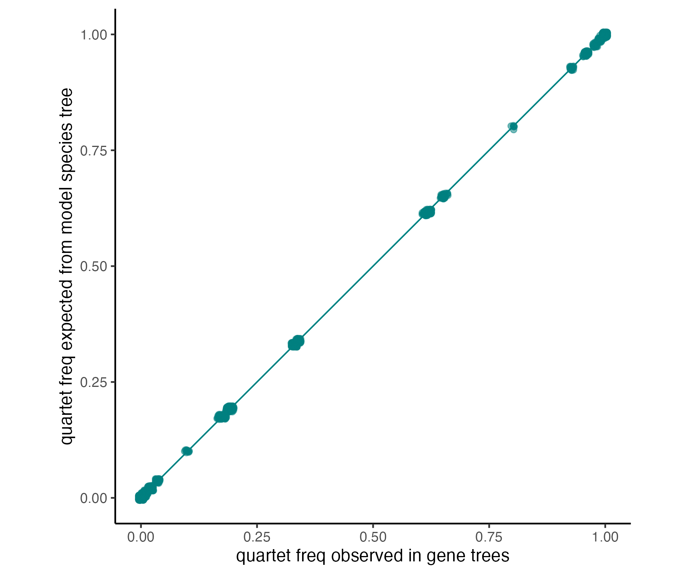
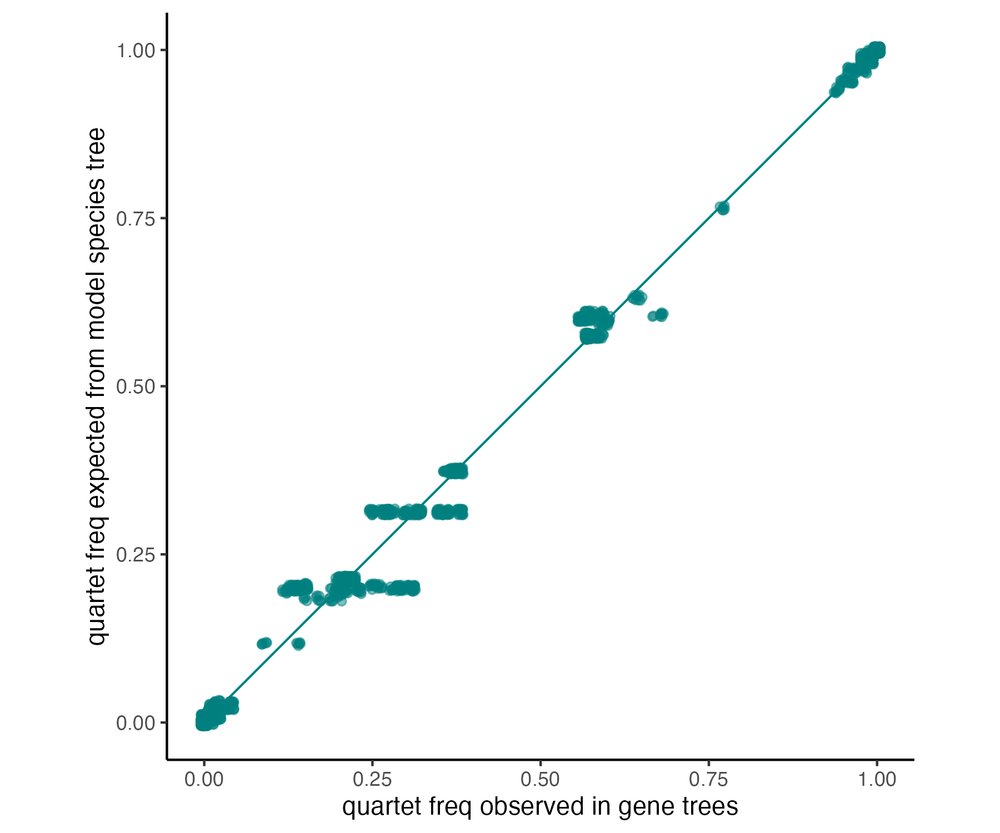

Activity D Solution
---

**Question D1**: For quartet `aptRow,rhePen|cryCin,galGal`,
```
qind,t1,t2,t3,t4,CF12_34,CF13_24,CF14_23,ngenes
400,aptRow,cryCin,galGal,rhePen,0.3314,0.3302,0.3384,10000.0
400,aptRow,cryCin,galGal,rhePen,0.27,0.35,0.38,100.0
```
where the top line is the header, the middle line is for 10K genes, and the bottom line is for repeating with 100 genes.

*It's notable that just by reducing the number of genes from 10K to 100, the incorrect quartet `aptRow,cryCin|rhePen,galGal` has higher frequency than `aptRow,rhePen|cryCin,galGal`. 
Additionally, the quartet frequencies might be misinterpretted as signals of hybridization when it's just limited number of (error-free!) gene trees.*

For quartet `aptRow,rhePen|cryCin,strCam`, we found
```
674,aptRow,cryCin,rhePen,strCam,0.3293,0.3389,0.3318,10000.0
74,aptRow,cryCin,rhePen,strCam,0.3,0.38,0.32,100.0
```

*Even though this quartet has the same expected values as the quartet above, the frequencies for 50 genes are much more accurate.*

For quartet, `cryCin,tinGut|eudEle,anoDid`, we found
```
761,anoDid,cryCin,eudEle,tinGut,0.0362,0.9268,0.037,10000.0
761,anoDid,cryCin,eudEle,tinGut,0.01,0.96,0.03,100.0
```

For quartet `notPer,eudEle|tinGut,anoDid`, we found
```
821,anoDid,eudEle,notPer,tinGut,0.1887,0.1933,0.618,10000.0
821,anoDid,eudEle,notPer,tinGut,0.15,0.25,0.6,100.0
```

**Question D2:** The pseudolikelihood (log) was 5.441432716820634 and 436.72598030242443 for 10K and 100 genes, respectively.

**Question D3:** The species tree is a perfect fit for 10K genes (left) and a reasonable fit for 100 genes (right) just noiser.

<p align="center">


</p>
