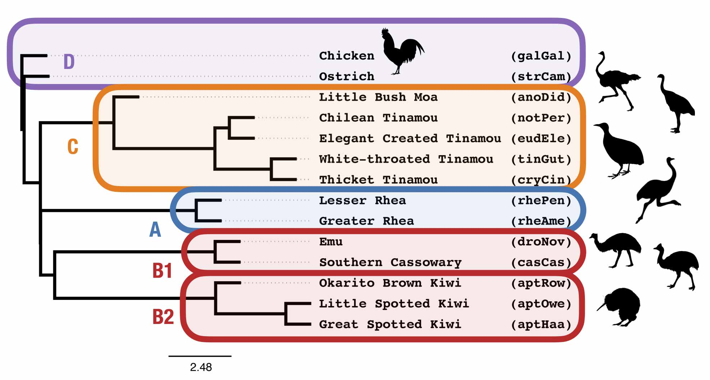

Coalescent Lab - Day 2
===

In this lab, we will estimate species trees on data sets from [Cloutier *et al.* (2019)](https://doi.org/10.1093/sysbio/syz019) using coalescent quartet-based methods. We will then compare and contrast the relationship between clades A, B1, B2, and C across the different methods and data types.

To fill in the table below, let's divide-and-conquer into ~7 groups. If your group finishes your portion of the table, try out some of the other analyses, prioritizing what you are interested in, or go back and work on the day 1 lab, or relax. :)

| Data | Study / Group | Method Type | Method | Species Tree Topology | Probability under MSC model species tree from day 1 | 
| --- | --- | --- | --- | --- | --- |
| CNEE | group 1 | GT Summary | TREE-QMC / ASTRAL | `((((A,(B1,B2)),C),strCam),galGal)`  |  |
| CNEE | group 2 | GT Summary | TREE-QMC-support |  |  |
| CNEE | group 3 | GT Summary | TREE-QMC-length |  |  |
| CNEE | group 4 | GT Summary | TREE-QMC-hybrid / ASTRAL-hybrid |  |  |
| CNEE | Cloutier *et al.* (2019) | Concatenation | ExaML | `(((((B1,C),B2),A),strCam),galGal);` | 0.0019 |
| intron | group 1 | GT Summary | TREE-QMC / ASTRAL |  |  |
| intron | group 2 | GT Summary | TREE-QMC-support |  |  |
| intron | group 3 | GT Summary | TREE-QMC-length |  |  |
| intron | group 4 | GT Summary | TREE-QMC-hybrid / ASTRAL-hybrid |  |  |
| intron | Cloutier *et al.* (2019) | Concatenation | ExaML | `(((((B1,B2),C),A),strCam),galGal);` | 0.0132 |
| UCE +105 | group 1 | GT Summary | TREE-QMC / ASTRAL |  |  |
| UCE +105 | group 2 | GT Summary | TREE-QMC-support  |  |  |
| UCE +105 | group 3 | GT Summary | TREE-QMC-length  |  |  |
| UCE +105 | group 4 | GT Summary | TREE-QMC-hybrid / ASTRAL-hybrid |  |  |
| UCE +105 | Cloutier *et al.* (2019) | Concatenation | ExaML |  `(((((B1,C),B2),A),strCam),galGal);` | 0.0019 |
| UCE -105 | group 1 | GT Summary | TREE-QMC / ASTRAL |  |  |
| UCE -105 | group 2 | GT Summary | TREE-QMC-support |  |  |
| UCE -105 | group 3 | GT Summary | TREE-QMC-length |  |  |
| UCE -105 | group 4 | GT Summary | TREE-QMC-hybrid / ASTRAL-hybrid |  |  |
| UCE -105 | Simmons *et al.* (2022) | Concatenation | Partitioned RAxML | `(((((B1,C),B2),A),strCam),galGal);` | 0.0019 |
| UCE -105 | group 5 | Site (ACGT) | SVDquartets |  |  |
| UCE -105 | group 6 | Site (ACGT) | CASTER-site |  |  |
| UCE -105 | group 6 | Site (ACGT) | CASTER-pair |  |  |
| CR1 | group 7 | Site (01) | TREE-QMC-bp |  |  |

Groups
---

* [Group 1 Activity](group1.md)
* [Group 2 Activity](group2.md)
* [Group 3 Activity](group3.md)
* [Group 4 Activity](group4.md)
* [Group 5 Activity](group5.md)
* [Group 6 Activity](group6.md)
* [Group 7 Activity](group7.md)

Other fun activities
---
Try evaluating the quality of **two** different species tree topologies found in the table, looking quartet frequencies around branches of interest (with TREE-QMC or ASTRAL), branch support values (with ASTRAL or CASTER), pseudolikelihood scores (with PhyloNetworks), and/or goodness of fit (with PhyloNetworks). Be sure to use the same input data when doing the comparison.

Dicussion Questions
---

1. What are some possible reasons for the differences in species trees across methods and/or data types? How would you explain the differences in species trees when running TREE-QMC with different settings on the UCEs? How would you explain the differences in species trees when running different versions of CASTER?
2. Given the pros/cons of different methods and the data types explored in this lab, are you convinced of a single species tree for *Palaeognathae*? If so, why? If not, what follow-up analyses would you recommend given unlimited resources?
3. This lab focused on gene tree heterogeneity due to ILS, GTEE, and data type. What are some other sources of gene tree heterogeneity? Could these be an issue for *Palaeognathae*? How would explore these issues further?
4. Are ILS, GTEE, and data type concerns for your study system?
