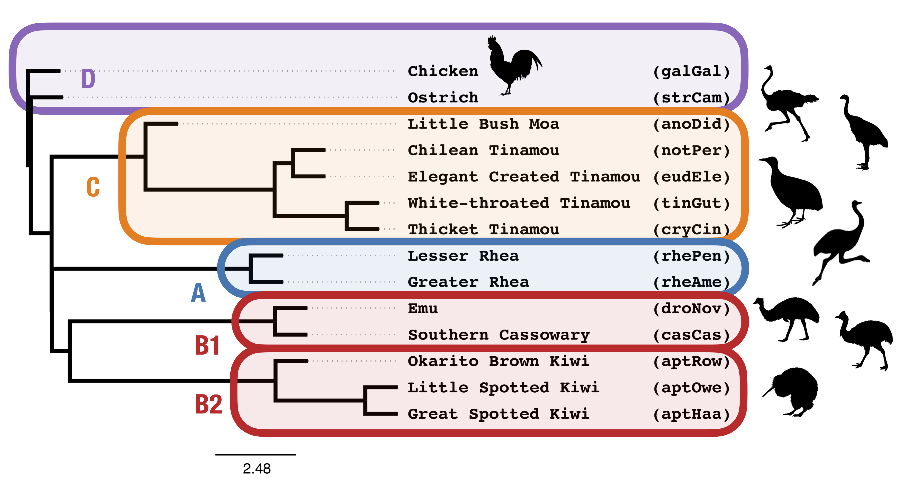

Coalescent Lab - Day 2
===

In this lab, we will analyze data from [Cloutier *et al.* (2019)](https://doi.org/10.1093/sysbio/syz019) and examine the relationship between clades A, B1, B2, C, and outgroups: chicken (`galGal`) and ostrich (`strCam`).

The lab today is open ended - focus on what you are interested in! 
It could be fun to divide the analyses up among your neighbors so that you can collectively fill in the table below.

| Method Class | Method | Data | Species Tree Topology |
| --- | --- | --- | --- | 
| Summary | TREE-QMC | intron | |
| | TREE-QMC-hybrid | intron | |
| | TREE-QMC | UCE | |
| | TREE-QMC-hybrid | UCE | |
| | TREE-QMC | UCE (minus 105) | |
| | TREE-QMC-hybrid | UCE (minus 105) | |
| Site (binary) | TREE-QMC-bp | CR1 | |
| Site | SVDquartets | UCE (minus 105) | |
| | CASTER-pair | UCE (minus 105) | |
| | CASTER-site | UCE (minus 105) | |
| Concatenation | RAxML | UCE (minus 105) | (((((C,B1),B2),A),strCam),galGal); |

Data
---

| Data | Directory |
| --- | --- |
| Intron gene trees with abayes support | [`../data/abayes-gene-trees/intron_abayes_gene_trees_sorted.tre`](../data/abayes-gene-trees/intron_abayes_gene_trees_sorted.tre) |
| UCE gene trees with abaye support | [`../data/abayes-gene-trees/UCE_minus_105_abayes_gene_trees_sorted.tre`](../data/abayes-gene-trees/UCE_minus_105_abayes_gene_trees_sorted.tre) |
| UCE gene trees with abayes support (minus 105 with homology errors) | [`../data/abayes-gene-trees`](../data/abayes-gene-trees) |
| CR1 presence/absence matrix | [`../data/CR1/4345ratites.nex.gz`](../data/CR1/4345ratites.nex.gz) |
| Concatenated alignment (UCEs minus 105)| [`../data/concatenation/UCE_minus_105.phy.gz`](../data/concatenation/UCE_minus_105.phy.gz) |

Activity A
---
Run gene tree summary methods on introns and UCEs

1. Try [TREE-QMC](https://github.com/molloy-lab/TREE-QMC); to learn about the method, see [Han & Molloy (2023)](https://doi.org/10.1101/gr.277629.122)
2. Repeat the above analysis weighting quartets based on branch support and branch length in the gene trees. Weighting was introduced by [Zhang & Mirarab (2022)](https://doi.org/10.1093/molbev/msac215) and has been implemented in several different summary methods, including ASTRAL, [ASTRID](https://doi.org/10.1186/s13015-023-00230-6), and TREE-QMC.
3. Compare quartet frequencies with and without weighting

*Note: In our analyses, [ASTRAL/ASTER](https://github.com/chaoszhang/ASTER/) gave the same results as TREE-QMC (both with and without weighting).*

Activity B
---
Reconstruct a species tree from the CR1 presence absence patterns

* Try [TREE-QMC](https://github.com/molloy-lab/TREE-QMC); to learn about the method, see [Molloy *et al.* (2021)](https://doi.org/10.1093/sysbio/syab086)

Activity C
---
Run coalescent site-based methods on the concatenated alignment

* Try [SVDQuartets](https://www.asc.ohio-state.edu/kubatko.2//phylogenomics2019/SpeciesTreeTutorial.html); to learn about the method, see[[Chifman & Kubatko (2014)]](https://doi.org/10.1093/bioinformatics/btu530)
* Try [CASTER](https://github.com/chaoszhang/ASTER/) (both site and pair); to learn about the method, see [Zhang *et al.* (2023)](https://doi.org/10.1101/2023.10.04.560884) 

Activity D (Optional)
---
Compare support values estimated using coalescent methods for some of the topologies found in the above activities

* Try [CASTER](https://github.com/chaoszhang/ASTER/) with the concatenated alignment
* Try [ASTRAL/ASTER](https://github.com/chaoszhang/ASTER/) with UCE gene trees; to learn more about the support calculations, see [Sayyari & Mirarab, 2016](https://doi.org/10.1093/molbev/msw079)

Dicussion Questions
---

1. What are the pros and cons of each type of method? 
2. How do you think these pros/cons relate to the Palaeognathae tree and the data types explored here?
3. What follow up work do you want to explore?
