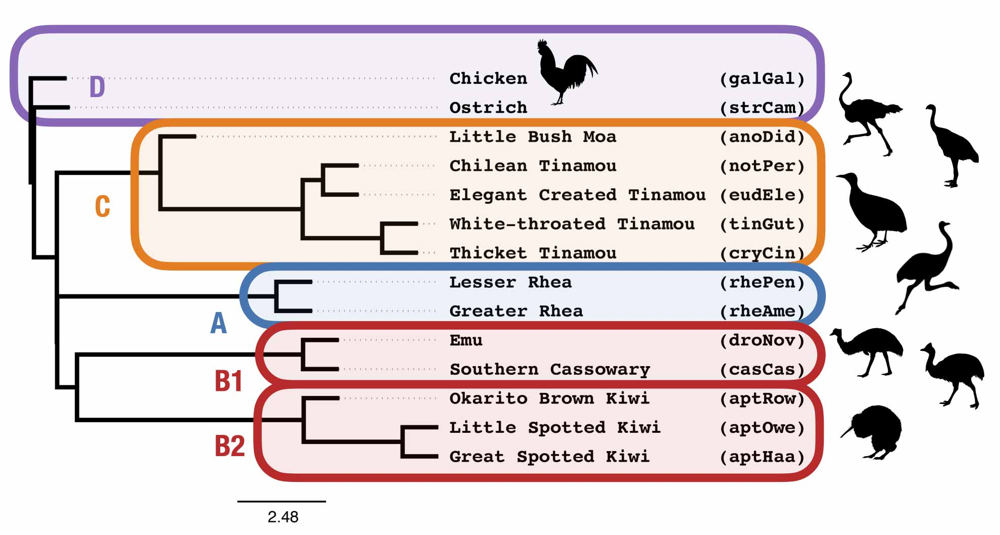

Group 1 Activity
===
In this lab, we will estimate species trees on data sets from [Cloutier *et al.* (2019)](https://doi.org/10.1093/sysbio/syz019) using coalescent quartet-based methods. We will then compare and contrast the relationship between clades A, B1, B2, and C across the different methods and data types.

Table
---

| Data | Study | Method Type | Method | Species Tree Topology | Probability under MSC model species tree from day 1 | 
| --- | --- | --- | --- | --- | --- |
| CNEE | group 1 | GT Summary | TREE-QMC / ASTRAL |  |  |
| intron | group 1 | GT Summary | TREE-QMC / ASTRAL |  |  |
| UCE +105 | group 1 | GT Summary | TREE-QMC / ASTRAL |  |  |
| UCE -105 | group 1 | GT Summary | TREE-QMC / ASTRAL |  |  |

Data
---

| Data | Directory |
| --- | --- |
| CNEE gene trees with abayes support | [`../data/abayes-gene-trees/CNEE_abayes_gene_trees_sorted.tre`](../data/abayes-gene-trees/CNEE_abayes_gene_trees_sorted.tre) |
| Intron gene trees with abayes support | [`../data/abayes-gene-trees/intron_abayes_gene_trees_sorted.tre`](../data/abayes-gene-trees/intron_abayes_gene_trees_sorted.tre) |
| UCE gene trees with abaye support | [`../data/abayes-gene-trees/UCE_minus_105_abayes_gene_trees_sorted.tre`](../data/abayes-gene-trees/UCE_minus_105_abayes_gene_trees_sorted.tre) |
| UCE gene trees with abayes support (minus 105 with homology errors) | [`../data/abayes-gene-trees/UCE_minus_105_abayes_gene_trees_sorted_plus105.tre`](../data/abayes-gene-trees/UCE_minus_105_abayes_gene_trees_sorted_plus105.tre) |

Analysis
---
Run [**TREE-QMC**](https://github.com/molloy-lab/TREE-QMC) (default mode) on all four sets of gene trees: CNEEs, introns, UCEs, and UCEs (minus 105 loci with homology errors). To interpret the results, consider quartet support in the estimated species tree as well as the [summary metrics](../data/abayes-gene-trees/README.md) reported for the input gene trees and their alignments.

Notes:
* Recall that the gene tree summary methods TREE-QMC and ASTRAL were introduced in the [Day 1 Lab](../day1/activityC.md).
* Gene tree summary methods are susceptible to gene tree estimation error (GTEE), which could be the result of low phylogenetic signal (if sequences are highly conserved), model violations (e.g., selection or heterotachy), or earlier errors made during ortholog identification and/or multiple sequence alignment.
* In this lab, both TREE-QMC and ASTRAL return the same tree given the same data set and same parameter settings (which is expected since these data sets have a small number of taxa and low missingness), so we focus on running TREE-QMC.
